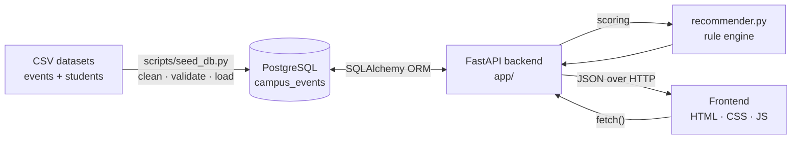
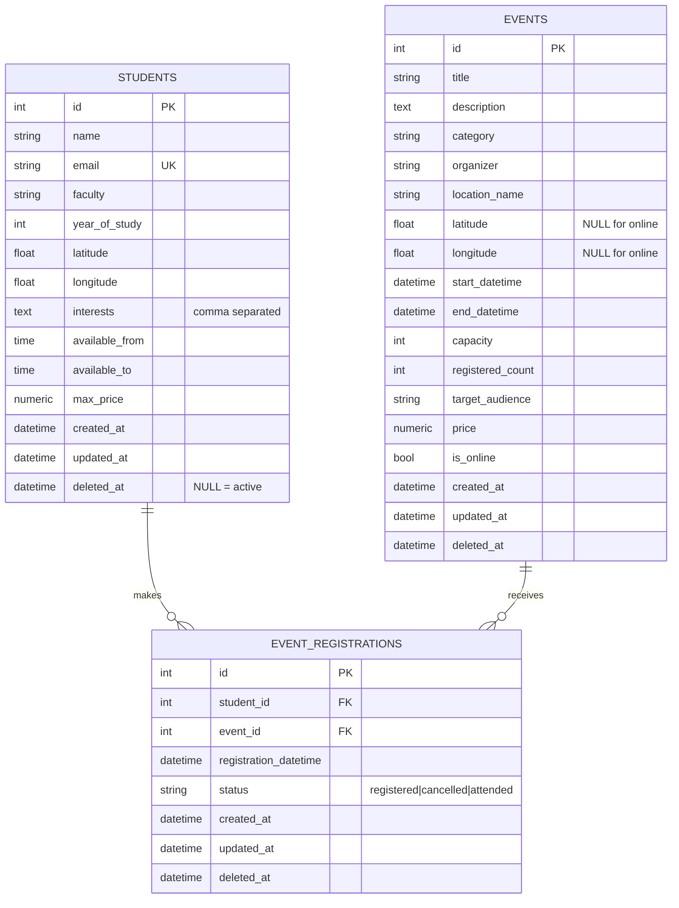

# Campus Event Recommendation System — Technical Documentation

**Project:** Implementation of Solution 2 — Campus Event Recommendation System
**Stack:** Python · FastAPI · SQLAlchemy · PostgreSQL · HTML/CSS/JavaScript
**Repository:** `campus-event-recommender`

> **Note for submission:** the course requires the technical documentation to be
> written on the template published on the *I am NEXT* platform (Lesson →
> Week07). This document contains all of the content that template asks for —
> copy each section into the corresponding template heading.

---

## 1. Introduction

### 1.1 Problem

Campus events — workshops, career fairs, club meetings, sports, cultural
activities, competitions, volunteering and networking — are announced across
email lists, Instagram posts, printed posters and several faculty websites.
Students have no single place to look, so attendance suffers even when an event
is highly relevant to them.

### 1.2 Solution

A system that stores all campus events in one PostgreSQL database and exposes a
REST API that, for any student, returns the events ranked by how relevant they
are to that specific student. Relevance is computed from the student's
interests, faculty, year of study, free time, location and budget.

The ranking is **deterministic and explainable**: the same request always
returns the same ordering, and every recommendation carries a numeric breakdown
plus a sentence explaining why it was suggested. No machine learning model is
used, and none is needed at this scale.

### 1.3 Intended deployment

The frontend is a single self-contained page designed to work as:

- a webview inside a university mobile application,
- a feature in a student portal,
- a recommendation widget embedded in a faculty website.

---

## 2. Architecture



### 2.1 Request flow for a recommendation

1. The browser calls `GET /recommendations/1?limit=30`.
2. `app/routers/recommendations.py` loads the student (404 if missing) and
   converts it into a `StudentProfile`.
3. `app/crud.py` loads all active events (`deleted_at IS NULL`).
4. `app/recommender.py` applies the hard filters, scores every surviving event
   across six components, and sorts the results.
5. The router maps the result into Pydantic schemas and FastAPI serialises it
   to JSON.
6. The frontend renders one card per recommendation.

### 2.2 Layers

| Layer | Files | Responsibility |
|---|---|---|
| Configuration | `app/config.py` | Reads `.env`, builds the database URL |
| Persistence | `app/database.py`, `app/models.py` | Engine, session, ORM models |
| Data access | `app/crud.py` | All queries; always excludes soft-deleted rows |
| Validation | `app/schemas.py` | Pydantic request/response contracts |
| Domain logic | `app/recommender.py` | Scoring engine — no database, no HTTP |
| HTTP | `app/main.py`, `app/routers/*` | Routing, status codes, CORS, static files |
| Presentation | `frontend/*` | Cards, filters, loading/error/empty states |

The scoring engine deliberately depends on **nothing** — not the database, not
FastAPI. It reads plain attributes off whatever object it is given, which is
why `tests/test_recommender.py` can test it with simple stub objects and why
the same engine serves both the stored-student and anonymous endpoints.

---

## 3. Technology stack

| Component | Choice | Why |
|---|---|---|
| Language | Python 3.11 | Required by the brief; good CSV/data tooling |
| Web framework | FastAPI | Required; automatic OpenAPI docs and Pydantic validation |
| ORM | SQLAlchemy 2.0 | Required; typed `Mapped[...]` models |
| Driver | psycopg2-binary | Required; stable PostgreSQL driver |
| Database | PostgreSQL 16 | Required; proper types for timestamps and numerics |
| Config | python-dotenv | Required; keeps credentials out of the repository |
| Env manager | uv | Required; fast, reproducible virtual environments |
| Frontend | Vanilla HTML/CSS/JS | Required; no build step, opens anywhere |
| Tests | pytest + requests | Unit, integration and live smoke tests |

---

## 4. Data preparation and processing

### 4.1 Datasets

| Dataset | File | Rows | Origin |
|---|---|---:|---|
| Events | `data/raw/campus_events_skopje.csv` | 100 | Provided with the brief |
| Students | `data/students.csv` | 90 | Generated by `scripts/generate_students.py` |

Both sit inside the recommended ranges (100–200 events, 70–100 students).

### 4.2 Student generation

`scripts/generate_students.py` produces realistic synthetic profiles:

- **Names** are Macedonian and gender-consistent — the surname suffix agrees
  with the first name (`Petrov` / `Petrova`, `Trajkovski` / `Trajkovska`).
- **Faculties** are weighted, not uniform: Computer Science and Engineering
  dominate, as they would at a technical faculty.
- **Interests** are the important part. Each student gets **2–4 interests**:
  most are drawn from a per-faculty affinity list, plus exactly one wildcard
  from the full category list. Without the wildcard the dataset would be too
  clean and the recommender would look better than it is; without the affinity
  it would be pure noise.
- **Coordinates** fall inside the same campus bounding box as the events
  (41.9905–42.0085 N, 21.3935–21.4360 E), so distances are realistic
  (tens of metres to a few kilometres).
- **Free-time windows** come from ten plausible ranges, and **max_price** is
  weighted toward 0 — most students prefer free events.

The generator is seeded (`RANDOM_SEED`, default `42`), so the dataset is
identical on every machine. This matters for reproducible demos and tests.

```bash
uv run python scripts/generate_students.py --count 90 --seed 42
```

### 4.3 Cleaning and validation

`scripts/seed_db.py` never trusts the CSV. Every field goes through a typed
cleaner before it reaches the database:

| Check | Behaviour |
|---|---|
| Encoding | Read as `utf-8-sig`, so a BOM does not corrupt the first header |
| Delimiter | `,` for `.csv`, `\t` for `.tsv`/`.tab` — auto-detected |
| Whitespace | Trimmed; repeated inner whitespace collapsed |
| Datetimes | Four accepted formats (`YYYY-MM-DD HH:MM`, with `T`, with seconds) |
| Times | `HH:MM` and `HH:MM:SS` |
| Booleans | `true/false`, `1/0`, `yes/no`, `y/n`, `t/f` |
| Decimals | Comma decimal separator (`0,5`) converted to a dot |
| Coordinates | Range-checked (−90..90, −180..180); required for on-site events, optional for online ones |
| `end_datetime` | Must not be before `start_datetime` — row rejected |
| `registered_count` | Clamped to `capacity` rather than rejecting the row |
| `interests` | Split, trimmed, title-cased, de-duplicated, re-joined |
| `email` | Lower-cased, must contain `@` and a dotted domain |
| Duplicate ids | Second occurrence skipped and reported |
| Blank lines | Skipped silently |

A row that fails validation is reported with its **line number** and skipped —
one broken record never aborts the import.

```bash
uv run python scripts/seed_db.py --dry-run    # validate only, write nothing
uv run python scripts/seed_db.py --reset      # drop, recreate, load
```

Result on the provided data:

```text
Events: 100 valid rows, 0 rejected
Students: 90 valid rows, 0 rejected
Done. students=90  events=100  registrations=0
```

### 4.4 Sequence realignment

Because the loader inserts explicit primary keys taken from the CSV, PostgreSQL's
identity sequences would still point at 1 and the first `POST /events` would
fail with a duplicate-key error. `sync_sequences()` runs `setval(...)` on every
table after loading, so the API can create new rows immediately.

---

## 5. Database design

### 5.1 ERD



### 5.2 Audit columns

Every table carries `created_at`, `updated_at` and `deleted_at`, implemented
once in a `TimestampMixin`:

- `created_at` — `server_default=func.now()`, set by PostgreSQL
- `updated_at` — `onupdate=func.now()`, refreshed on every write
- `deleted_at` — `NULL` means active; a timestamp means **soft deleted**

Soft deletion is why every read helper in `app/crud.py` starts from
`select(Model).where(Model.deleted_at.is_(None))`. Centralising it there means
no router can accidentally leak a deleted row.

### 5.3 Design decisions

**Interests as a comma-separated string.** The brief allows a comma-separated
string, a JSON field or a many-to-many table. The string was chosen because:

- interests are only ever read as a whole set, never queried individually in
  SQL — the scoring engine loads them into a Python set anyway;
- a join table would add two queries and a mapping layer for zero benefit at
  90 students;
- the CSV format is already comma-separated, so import and export stay trivial.

The model exposes `Student.interest_list`, so the rest of the code never parses
the string by hand, and `StudentRead.interests` is a proper JSON array in the
API. **If** the system later needed "how many students are interested in
Technology?" as a SQL aggregate, the right move would be a many-to-many table —
the property keeps that migration cheap.

**Nullable coordinates.** Online events have no physical location, so
`latitude`/`longitude` are nullable and the distance component handles them as
a special case instead of pretending they are at 0°N 0°E.

**`price` and `max_price` as `NUMERIC(8,2)`.** Money should never be a float.

**Indexes.** `events.category` and `events.start_datetime` back the two most
common filters; `deleted_at` is indexed on every table because it appears in
every single query.

**`event_registrations`.** Optional in the brief, implemented as an extension.
A unique constraint on `(student_id, event_id)` prevents double registration,
and `POST /registrations` increments the event's `registered_count`, which
immediately feeds back into the capacity component of the score.

---

## 6. Backend API

FastAPI generates interactive documentation at `/docs`; the table below is the
summary.

### 6.1 Endpoints

| Method | Path | Status codes | Description |
|---|---|---|---|
| `GET` | `/health` | 200 | Liveness + database check |
| `GET` | `/events` | 200 | List events with combinable filters |
| `GET` | `/events/{event_id}` | 200, 404 | Single event |
| `GET` | `/events/categories` | 200 | Distinct categories |
| `POST` | `/events` | 201, 422 | Create an event |
| `GET` | `/students` | 200 | List student profiles |
| `GET` | `/students/{student_id}` | 200, 404 | Single profile |
| `POST` | `/students` | 201, 409, 422 | Create a profile |
| `GET` | `/recommendations/{student_id}` | 200, 404 | Ranked events for a student |
| `GET` | `/recommendations?lat=&lon=&interests=` | 200 | Ranked events for an ad-hoc profile |
| `GET` | `/registrations` | 200 | List registrations *(extension)* |
| `POST` | `/registrations` | 201, 404, 409 | Register a student *(extension)* |

### 6.2 Event filtering

The three required filters are query parameters on `GET /events` and combine
with `AND`:

```text
GET /events?category=Technology
GET /events?date=2026-09-23
GET /events?free_only=true
GET /events?category=Technology&date=2026-09-23&free_only=true
```

Implementation notes:

- `category` uses `ILIKE`, so `technology` and `Technology` behave identically.
- `date` is expanded into a full-day range (`00:00:00`–`23:59:59.999999`)
  rather than casting the column, which keeps the `start_datetime` index usable.
- `free_only=true` means `price = 0`.
- Three extra filters were added beyond the requirement: `is_online`, `search`
  (title/description substring) and `upcoming_only`, plus `limit`/`offset`
  paging.

The same filters are exposed in the frontend and are also accepted by
`GET /recommendations/{student_id}` (`category`, `free_only`), so a student can
narrow the ranked list without losing the scoring.

### 6.3 Two recommendation endpoints, one engine

`GET /recommendations/{student_id}` loads a stored profile.
`GET /recommendations?lat=…&lon=…&interests=…` builds a temporary profile from
query parameters, which is what an embedded widget would use for a visitor who
is not logged in. Both construct the same `StudentProfile` named tuple and call
the same `recommend()` function — there is no second implementation to keep in
sync.

### 6.4 Validation and error handling

- Pydantic validates every request body and query parameter; a bad payload
  returns `422` with a field-level explanation, automatically.
- `end_datetime` before `start_datetime` → `422` (validator in `schemas.py`).
- Duplicate student email → `409`.
- `available_to` not after `available_from` → `422`.
- Unknown id on any `GET .../{id}` → `404` with a readable `detail` message.
- Registering twice, or for a full event → `409`.

---

## 7. Recommendation logic

The brief leaves the weights, thresholds and special cases as design decisions.
This section states them and justifies them.

### 7.1 Two stages

**Stage 1 — hard filters.** Events the student *cannot* attend are removed
before any scoring happens:

| Filter | Rule | Why it is a filter, not a penalty |
|---|---|---|
| Past events | `start_datetime <= now` | An event that already started cannot be attended at all |
| Sold out | `capacity > 0 AND available_places <= 0` | Recommending a full event wastes the student's time |
| Over budget | `price > student.max_price` | The student stated a hard limit; overriding it is disrespectful |
| Wrong year | `target_audience` is a year band the student is not in | A first-year-only event is closed to a third-year student |

Filtering first keeps the score meaningful: a **0 in a component means "weak
match", never "impossible"**. If these were penalties instead, a sold-out event
with a perfect interest match could still outrank an attendable one.

Note the asymmetry between price and faculty: price is a *stated limit*, so it
filters; faculty is a *preference signal*, so a Philology event still appears
for a Computer Science student — just far down the list.

**Stage 2 — weighted scoring**, out of exactly 100 points.

### 7.2 The weights

| Component | Points | Share | Justification |
|---|---:|---:|---|
| Interest match | 35 | 35% | The single strongest predictor of whether a student attends. A perfect event in the wrong topic is still the wrong event. |
| Time availability | 20 | 20% | Second only to interest: if it clashes with lectures, relevance is theoretical. Weighted below interest because students *do* rearrange their day for something they really want. |
| Audience / faculty | 15 | 15% | Meaningful context, but a motivated student attends events outside their faculty all the time. |
| Distance | 15 | 15% | On a compact campus most events are within a kilometre, so distance separates results but rarely decides them. Equal to audience by design. |
| Price | 8 | 8% | Already handled as a hard filter; these points only separate *free* from *affordable*. |
| Capacity | 7 | 7% | A tie-breaker that nudges events the student can still actually get into. |
| **Total** | **100** | | |

The split is deliberately **top-heavy**: interest and time together are 55% of
the score, so the ranking is dominated by "do you care about this, and can you
be there?" The remaining 45% refines the order among events that already pass
that test.

The weights live as named constants at the top of `app/recommender.py`
(`W_INTEREST`, `W_TIME`, …), so changing the policy is a one-line edit with no
hunting through the code.

### 7.3 Component definitions

#### Interest match — 0 to 35

| Case | Points | Reasoning |
|---|---:|---|
| Event category is one of the student's interests | 35.0 | Exact hit |
| Category is *related* to an interest | 19.25 (55%) | A Technology student usually enjoys a Science talk |
| An interest keyword appears in the title/description | 10.5 (30%) | Catches relevance the category label misses |
| No connection | 0 | |
| Student has no interests on file | 17.5 (50%) | Neutral: show a balanced mix rather than nothing |

Relatedness comes from a hand-written `RELATED_CATEGORIES` map
(`Technology ↔ Science, Workshop, Competition`; `Career ↔ Networking, Business`;
`Art ↔ Culture, Music`; and so on). Partial credit matters: a student who listed
only "Technology" would otherwise see a very short list, and the point of a
recommender is to widen the funnel a little without drowning the signal.

Keyword matching ignores interests shorter than four characters to avoid
accidental substring hits (`"Art"` inside `"start"`).

#### Time availability — 0 to 20

Both the event and the student's window are converted to minutes-since-midnight
and intersected:

```text
points = 20 × (overlap_minutes / event_duration_minutes)
```

- Event entirely inside the window → 20.
- Half the event fits → 10 (and the reason says "partly fits your available
  time (50%)").
- No overlap → 0.

Proportional scoring rather than all-or-nothing is the right model because a
student can realistically attend the first hour of a two-hour event; a binary
rule would throw those away. Events and windows that appear to cross midnight
are clamped to the end of the day, so a bad data row cannot produce a negative
overlap.

#### Audience / faculty — 0 to 15

| `target_audience` | Points |
|---|---:|
| A year band the student belongs to (`First Year Students`, `Final Year Students`) | 15.0 |
| Exactly the student's faculty | 15.0 |
| `All Students` | 12.0 (80%) |
| Another faculty | 3.0 (20%) |
| Empty / unknown | 7.5 (50%) |

A faculty-specific event scores above a general one because the content is
tailored. "Another faculty" keeps a small non-zero value so those events are
ranked last rather than hidden — students *do* cross faculties, and the brief
asks for relevance, not gatekeeping.

#### Distance — 0 to 15

Distance uses the **Haversine formula** (great-circle distance on a sphere,
Earth radius 6371.0088 km):

```text
a = sin²(Δφ/2) + cos φ₁ · cos φ₂ · sin²(Δλ/2)
d = 2 · R · arcsin(√a)
```

| Case | Points |
|---|---:|
| Online event | 15.0 |
| ≤ 0.5 km | 15.0 |
| 0.5 – 5 km | linear decay from 15 → 0 |
| ≥ 5 km | 0 |
| Coordinates unavailable | 7.5 (50%) |

**Online events receive full marks, not zero.** There is no travel at all, which
is the best possible case for the thing this component measures — treating a
missing coordinate as "infinitely far" would be a modelling error.

The 0.5 km plateau exists because anything on campus is effectively "right
there"; differentiating 180 m from 320 m would be false precision. The 5 km cut
matches the city scale of the dataset.

#### Price — 0 to 8

| Case | Points |
|---|---:|
| Free | 8.0 |
| Paid, within budget | `8 × (0.5 + 0.5 × (1 − price/budget))` → 4.0–8.0 |
| Over budget | filtered out earlier |

Half the points are for being affordable at all, half scale with how cheap it
is. So a 2 MKD event with a 10 MKD budget scores 7.2, while a 9 MKD one scores
4.4 — both are acceptable, one is clearly friendlier.

#### Capacity — 0 to 7

Based on the share of seats still free (`available_places / capacity`):

| Free share | Points |
|---|---:|
| ≥ 50% | 7.0 |
| 20% – 50% | 4.9 (70%) |
| < 20% | 2.8 (40%) |
| Capacity unknown (0) | 3.5 (50%) |

Full events were already removed, so this component expresses urgency, not
availability: a nearly-full event is still worth recommending, just below an
equally good one the student can comfortably get into.

### 7.4 Ordering and determinism

```python
scored.sort(key=lambda s: (-s.raw_score, s.event.start_datetime, s.event.id))
```

The sort uses the **unrounded** score, so two events shown as "84" keep their
true order. Ties break on the earlier start time (sooner is more actionable),
then on the lower id (a stable, arbitrary but reproducible final tiebreak).
Nothing in the pipeline uses randomness, wall-clock jitter or dictionary
ordering, so the same request always returns the same list — verified by
`test_recommendation_is_deterministic` and by the live smoke test.

### 7.5 Explainability

Each component returns both its points and a short phrase. `build_reason()`
sorts those phrases by how many points they contributed, takes the top three
and joins them into a sentence:

> *Matches your Technology interest, fits your available time and is very close
> to you (0.28 km).*

The API also returns the full `score_breakdown` object, and the frontend renders
it as a bar chart under "How this score was calculated". A student — or an
examiner — can always see exactly where the number came from.

### 7.6 Worked example

Student 1, Marko Cvetkov — Computer Science, year 1, interests
`Career, Science, Technology`, free 11:00–17:00, `max_price = 0`, located at
(41.99234, 21.42498).

Top result: **Cybersecurity Basics for Students** — Technology, 27 Sep
12:00–13:00, Public Room Skopje, free, 26 of 40 places left.

| Component | Points | Why |
|---|---:|---|
| Interest | 35.0 / 35 | Category `Technology` is one of his interests |
| Time | 20.0 / 20 | 12:00–13:00 sits fully inside 11:00–17:00 |
| Audience | 15.0 / 15 | `target_audience = Computer Science` = his faculty |
| Distance | 15.0 / 15 | 0.278 km, inside the 0.5 km plateau |
| Price | 8.0 / 8 | Free |
| Capacity | 7.0 / 7 | 65% of places still available |
| **Total** | **100** | |

### 7.7 Does the model actually discriminate?

Scoring all 90 students against all 100 events produces **7,623** eligible
student–event pairs (77–93 candidates per student, mean 84.7):

| Score range | Pairs | Distribution |
|---|---:|---|
| 20–29 | 524 | `█████████████` |
| 30–39 | 810 | `████████████████████` |
| 40–49 | 1,419 | `███████████████████████████████████` |
| 50–59 | 1,380 | `██████████████████████████████████` |
| 60–69 | 1,509 | `█████████████████████████████████████` |
| 70–79 | 987 | `████████████████████████` |
| 80–89 | 715 | `█████████████████` |
| 90–99 | 266 | `██████` |
| 100 | 13 | |

Mean 57.3, median 57, range 20–100. This is the shape a useful scoring function
should have: a broad middle, a thin tail of excellent matches (only 13 perfect
scores out of 7,623 — 0.17%), and no clustering that would make the ranking
arbitrary. A model that returned 90+ for everything would be flattering and
useless.

Sample top recommendations across different profiles:

| Student | Profile | Top recommendation |
|---|---|---|
| #1 Marko Cvetkov | CS, y1, Career/Science/Technology, 11–17, free only | **100** Cybersecurity Basics for Students *(Technology, 0.28 km)* |
| #2 Jovana Ilieva | Economics, y1, Competition/Music, 16–22, free only | **86** Programming Challenge Warmup *(Competition, 0.15 km)* |
| #3 Bojan Pavlov | Engineering, y1, Technology/Volunteering, 12–18, ≤10 | **100** Git and GitHub Clinic *(Technology, 0.29 km)* |
| #7 Sofija Lazareva | Law, y1, Networking/Culture/Art, 08–12, ≤15 | **96** Women in Tech Meetup *(Networking, 1.74 km)* |

Each student gets a top result that matches their own stated interests, not a
globally "popular" event — which is the behaviour a recommender is supposed to
exhibit.

---

## 8. Frontend

A single page, no framework and no build step: `index.html`, `styles.css`,
`app.js`. It is served by FastAPI itself at `/app/index.html`, so the demo needs
only one process and has no CORS problems.

### 8.1 Features

- **Student selector** populated from `GET /students`, with
  `?student_id=1` support as the brief requires. The URL updates as the
  selection changes, so any view can be linked or bookmarked.
- **Profile summary** — faculty, year, free-time window, budget and interest
  chips — so it is obvious *why* the recommendations look the way they do.
- **Filters**: category, date, free-only; they apply to both tabs.
- **Two tabs**: *Recommended* (scored cards) and *All events* (plain browsing).
- **Cards** showing title, category, organizer, location, date and time,
  distance, price, places left, score, and the reason sentence.
- **Score breakdown**, collapsed by default, rendered as bars per component.
- **Loading, error and empty states**, all three implemented and tested.
- **Mobile-first CSS** — the base stylesheet targets small screens and media
  queries widen the layout at 620 px. Also supports dark mode via
  `prefers-color-scheme` and reduced motion.

### 8.2 Implementation notes

- `escapeHtml()` is applied to every value interpolated into the DOM.
- A monotonically increasing `requestId` guards against out-of-order responses,
  so quickly changing filters can never render a stale result.
- The API base URL resolves from `?api=…`, then the page origin, then
  `http://127.0.0.1:8000` — so the page also works opened directly as a file.
- `GET /health` runs first; a failure shows an actionable error state with the
  exact command needed to start the backend.
- The date filter is applied client-side on the *Recommended* tab so ranking is
  still computed over the student's full candidate list, and server-side on
  the *All events* tab where no ranking is involved.

Screenshots: `docs/screenshots/`.

---

## 9. Testing

| Suite | File | Count | Needs a database |
|---|---|---:|---|
| Unit — scoring engine | `tests/test_recommender.py` | 34 | No |
| Integration — API | `tests/test_api.py` | 35 | Yes |
| Live smoke test | `scripts/api_smoke_test.py` | 32 checks | Yes + running server |

```bash
uv run pytest                            # 69 passed
uv run python scripts/api_smoke_test.py  # 32 passed, 0 failed
```

What is covered:

- Haversine correctness (zero distance, a known 37.6 km reference, symmetry).
- Every hard filter individually.
- Every scoring component: exact/related/keyword/no interest match; full,
  partial and zero time overlap; faculty vs. general vs. other audience;
  distance decay; free vs. affordable; capacity tiers.
- A constructed "perfect" event scoring exactly 100, and the breakdown summing
  to the total.
- Ordering: descending score, tie-breaks, `limit`, `min_score`, and
  determinism across repeated calls.
- Every endpoint, every filter and every filter *combination*, including one
  that must return an empty list.
- Error paths: 404 for unknown ids, 409 for duplicate email and double
  registration, 422 for an inverted time window and for `end < start`.
- Frontend: driven with headless Chromium — 0 console errors, filters applied,
  empty state and error state both triggered deliberately.

Full captured output: `docs/test-evidence.md`.

---

## 10. How to run

```bash
# 1. database
sudo -u postgres psql -c "CREATE USER campus WITH PASSWORD 'campus';"
sudo -u postgres psql -c "CREATE DATABASE campus_events OWNER campus;"

# 2. configuration
cp .env.example .env

# 3. dependencies
uv venv && uv pip install -e ".[dev]"

# 4. data
uv run python scripts/generate_students.py
uv run python scripts/seed_db.py --reset

# 5. run
uv run uvicorn app.main:app --reload
```

- Frontend: <http://127.0.0.1:8000/app/index.html?student_id=1>
- Swagger UI: <http://127.0.0.1:8000/docs>

---

## 11. Limitations and possible extensions

**Known limitations**

- Distance is straight-line, not walking distance — fine on a compact campus,
  less so across a river or a motorway.
- The related-category map is hand-written; it encodes one person's judgement
  about which topics are adjacent.
- Scoring loads all active events into memory. At 100 events this is instant;
  at 100,000 the hard filters should move into SQL.
- Recommendations ignore what the student has actually attended before —
  deliberately, since the brief rules out learned behaviour.

**Natural extensions**

- Use the `event_registrations` table to down-rank categories a student has
  repeatedly skipped — still rule-based, still explainable.
- Per-student weight overrides ("I care more about price than distance").
- Caching recommendations per student until the event table changes.
- Calendar export (`.ics`) and email digests.
- Organiser-facing statistics: which faculties a given event actually reaches.

---

## 12. Summary

| Requirement from the brief | Status |
|---|---|
| Data preparation and processing | 100 events + 90 generated students, validated on import |
| Database design + PostgreSQL | 3 tables, audit columns, soft delete, indexes |
| FastAPI backend + required endpoints | All 8 required endpoints + 4 extras |
| Event filtering (category, date, free) | Query parameters, combinable, exposed in the UI |
| Recommendation logic and scoring | 6-component, 100-point deterministic model with breakdown + reason |
| Frontend + backend integration | Responsive page, all states, student selector, `?student_id=` |
| Documentation + repository | This document, README, test evidence, screenshots |
| No ML, explainable, runs locally | Satisfied |
